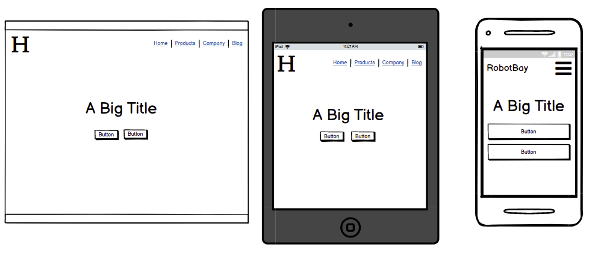
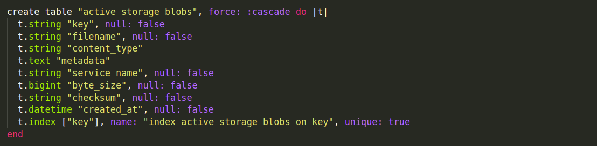

# T2A2 - Marketplace app

##	Identification of the problem you are trying to solve by building this particular marketplace app.
The world is becoming every reliant on robots from cleaning our floor, driving our car and in the near future possibly humanoids that can do every task for us. 

we still are at the very beginning of the adoption curve meaning that new robots are being consistently being invented and innovated on. The robot market is  
growing exponentially, within the last year sales for robots have grown by 19.6% from the industries such as manufacturing, consumer, entertainment and education. By creating a marketplace app users will have one convenient location for all their robot needs. 

##	Why is it a problem that needs solving?
With this every increasing robot market, people will need a place where they can buy and sell robots that they have manufactured or older robots they no longer have use for.  

The app will provide users with one convenient location where they can list their robots for other users to buy. Sellers will be able to add a title to their robot, a description of what the robot does, and an image of what the robot looks like. They will also be able to tell if a robot has been sold so that they can monitor which robots sell the best. Buyers will have a list of previous purchases so they can keep track of the robots that they have bought.     

---  

## Source Links
Website URL - [RobotBay - Heroku](https://robotbay.herokuapp.com/)

Github repo - [RobotBay - Github](https://github.com/Mauricepwong/robotbay_T2A2)

---

##	Description of your marketplace app (website), including:

### Purpose
The purpose of this marketplace application is to provide one convenient location where users can buy and sell robots that they own. 

### Functionality / features

 - Browsing robots - All users will have access to the homepage, robot listing, so that they can browse and have a look at what robots are available but will need to sign up to purchase or list robots of their own. 

 - User accounts - Once a user signs up they will have their own account that they can login to, access and  edit. Here they will be able to see what robots they are selling, if it has been sold and what robots they have purchased. The owner of a robot will be the only one to have access to edit or delete their robot.

 - Listing robots - Signed in users can list their robots up for sale with their name, description, categories, price and image. They will be able to see this in their account and when it has been purchased.   

 - Buying robots - Signed in users will be able to buy a robot, enter in their card details and purchase the robot. They will then be able to see the purchased robot in their account.  

 - Sorting - Users can sort the robots listing so they can view the robots that are important to them more easily. 

 - Image upload - Users can upload images to their profile and an image to the robot that they created. 

### Sitemap

### Screenshots

Home

Listing robots

Manage robots

Show Robot  

Profile page

Sell Robot

### Target audience
The target audience for this app will be for robot enthusiasts who would like to browse and check out the latest robots and purchase them. It is also targeted at robot manufacturers and owners of current robots that would like to list their robots on here up for sale.   

### Tech stack (e.g. html, css, deployment platform, etc)
- Visual Studio Code - Code editor used
  - Prettier 
  - Markdown preview
- Rails
- Ruby 
- Devise - User authentication platform 
- Postgresql database
- Stripe - payment platform
- Bootstrap - css framework
- Heroku - web hosting
- HTML
- CSS

---

##	User stories

As a User, I want to be able to sign up to the site, so that I can post robots to sell and buy robots.

As a User, I want to be able to see the list of robots on the website, so that I know what robots are available.

As a User, I want to be able to sort and filter the robots, so that I can find robots I am interested in quicker.

As a Signed up User, I want to be able to log into the site, so that I can access my account.

As a Logged in User, I want to sign out, so that I can end my session on the site.

As a Logged in User, I want to edit my information, so that if my information changes I can update it.

As a Logged in User, I want to delete my profile, so that remove my information from the system when I no long want it.

As a Buyer, I want to see my previous purchases, so that I can see what robots I have bought before.

As a Buyer, I want to be able to purchase a robot , so that I can take it home and use it.

As a Buyer, I want to receive a confirmation email, so that I have know the order has gone through and I have 
record of it.

As a Seller, I want to be able to post robots to sell, so that a buyer can purchase them.

As a Seller, I want to update my robot posts, so that if information is incorrect I can edit it.

As a Seller, I want to remove my robot posts, so that if I no longer want to sell the robot it can be taken off 
the site .

As a Seller, I want to see all the robots I have posted, so that I know which robots I have put up for sale.

As a Seller, I want to see which robots have been sold, so that I can figure out which are the popular ones.

As a Seller, I want to be able to upload images, so that I can show users what my robot looks like.

---

## Wireframes for your app

### Homepage

### Listing page

### Manage robots page

### Sell Robot page

### Show Robot page

---

## An ERD for your app
 

---
 
## Explain the different high-level components (abstractions) in your app

Robotbay is a two sided marketplace. Its an application built on ruby and rails with bootstrap for the CSS. When a user visits the site they will have access to the robots listing page only as an observer. To perform actions buy/post/sell they will need to sign up. Devise was used for user authentication. The devise methods were used throughout the site to give the user different actions and view. The most used method were User_signed_in? and current_user. These were also used for parts of the authorisation of different method e.g. editing a robot, deleting a robot and purchases 

Upon sign up users will be given option to buy and post robots. When a user post a robot their user_id will be assigned to that user so they can edit and delete at a later date. When posting they can upload a image which will be stored remotely on ASW S3. This is so the application doesnt get overloaded with images and can be scaled if needed. It is mandatory for them to submit a name a nd price of the robot but they can also assign categories to that robot. 

The user will be able to see that robot in the listing page as well on their manage robots page.

From the listing page into the details (show) page, users can purchase a robot. When they click the buy button, they will be sent off to a payment gateway (stripe) to enter in their payment information where if successful will be sent to a success page. in the backend a transaction will be created. This will tell the user of the robot that it has been purchased and no longer let them change the details of that robot. It will also store this robot in the manage robot purchased list of the buyer. 

---

## Detail any third party services that your app will use

The following third party apps were used in this app:
 - Heroku (Web hosting service) - Heroku was used to host my website. It is a Platform as a Service (PaaS) and was chosen because it allows for both front end and back end to be hosted on their platform. 

 - Stripe - This is a payment gateway API that allow secure payments to be done within the application. This was used so that the users can purchase robots securely. 

 - Amazon Web Services S3 - Cloud based storage solution. This is used to store images of the robot pictures and user profiles. This service allows us to store the uploaded images remotely and not in our application. Also allowing our application to be more flexible in terms of storage with the current demand required as AWS S3 is highly scalable.

 - Github - This was used to store repository remotely. 

---

## Describe your projects models in terms of the relationships (active record associations) they have with each other

User Has_one_attached profile - This for the profile picture

User has_many robots - User can own many robots, so a robot belongs_to users  

User has_many sales. This is where the user_id == seller_id in the transaction table. 
User has_ many sold_robots. This will pick up the robots that have been sold in a transaction with this particular user.  

User has_many purchases. This is where the user_id == buyer_id in the transaction table.  
User has_many purchased robots. this will pick up robots that have been purchased by this particular user.

Transactions belong_to seller, buyer and robot. The buyer is defined in the user table and the robot and seller are defined in the robots table under user_id and robot_id.  

Robot has_one_attache image - This is the image of the robot. 
A robot belongs_to User - As robot can only have one user

A robot has_and_belongs_to_many categories. This is a many to many relationship so the reverse relationship also applies to categories. 

A robot has_one sale. this is defined in the transaction table. As a robot can only be sold once. 

---

## Discuss the database relations to be implemented in your application

Defined in the ERD diagram. 

Users can have many robots, sales, sold_robots, purchases and purchased robots. and can have 1 profile picture

Robots can only have one user and one sale. A robot can belong to many categories. and can have 1 image of the robot. 

Transactions is a joining table where a robot can be sold once but a seller can have many robots and sales so many transactions. A buyer can also buy many robots so also many transactions.

Categories can belong to many robots.

---

## Provide your database schema design

 
active_storage_attachment

 
active_storage_blob

 
active_storage_variant_record

Active storage allows an image to be associated with a record. In this case for the robots and users. 

 
Categories

Just stores the name of the categories which a robot could fall under.  

 
Categories_robots

Joining table for the many to many relationship of robots and categories. 

 
Robots

The robot table hold all the general information for the robot. The name and price were mandatory. User_id was add so you can tell who owns the robot. Also added was a boolean field of sold to identify if the robot had been sold.   

 
Transactions

A transaction would be created and recorded when a robot was purchased. The seller Id would be the user associated with the robot being purchased and the buyer id was the current user that was logged in.  

 
Users

Users was created with the devise gem. The email and id was used as the unique identifer and as email is login that needed to be unique. Username was added later and was defined as required as this would be displayed on the robot listing page. 

 
Foreign key

This identifies all the foreign keys in the database. 

---

## Describe the way tasks are allocated and tracked in your project
 
[Trello](https://trello.com/b/gSeoN3pT/marketplace-app)

I used Trello to track and allocate tasks in my projects. I first broke down my application into the relevant requirements. To get a good understanding of how my app should function i wrote out some user stories and pseudo code. I then pulled out the functions and features to determine what needed to be coded. 

I then created the Trello board and listed out all the features, requirements and functionality. I prioritised items where the base code was needed to build on other items and any shared functionality as well as ones that spoke directly to the requirements. The optional items I placed in stretch goals and addressed them if time was still available once I completed the core functions. 

I created checklists for items that needed to be broken down further and t-shirt sizings labels (S, M, L) to signify the time and effort needed for a particular item. Some items that required continuos tracking I placed another label on these (e.g. deploying to heroku, implementing bootstrap on different elements.) 